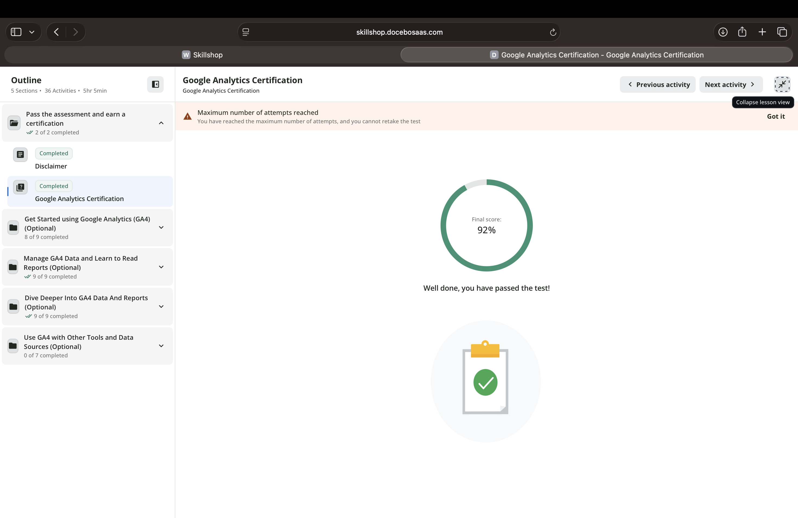
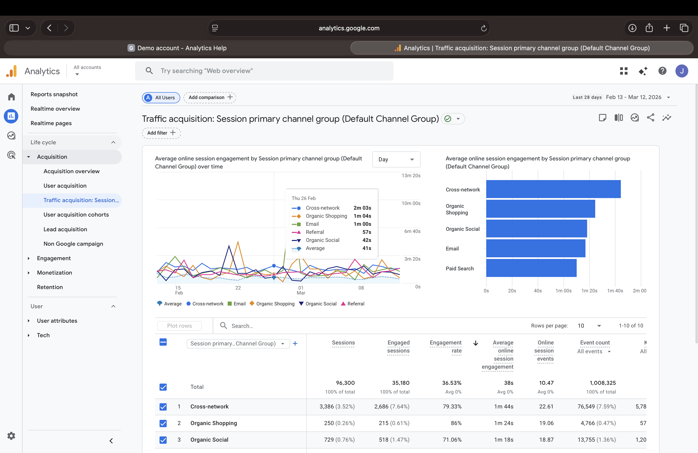

# Proof of Completion

Below is my completion evidence for the Google Analytics 4 certification.

# Exam Reflection

## Results Summary

I completed the Google Analytics 4 certification exam. My score was 92%. The exam tested my understanding of GA4 reporting tools, event tracking, and data analysis techniques.

## Top 3 Challenging Topics

- Event tracking and conversions
- Attribution and traffic sources
- GA4 explorations and reporting tools

## Two Concepts I Would Redo

One concept I struggled with was understanding how attribution works in GA4 and how conversions are assigned to marketing channels.

Another concept I would redo involves using explorations to analyze user behavior and selecting the right metrics for analysis.

## CEP Connection

One change I will make to my CEP measurement plan is focusing more on tracking conversions instead of only page views. I will use event tracking to measure important user actions such as sign-ups or purchases.

# GA4 Readiness Check

## KPI

Conversion Rate

## Supporting Report

## Explanation

The Traffic Acquisition report helps identify which marketing channels bring users to the website and which ones generate conversions. This helps measure marketing performance and supports data-driven decisions for improving campaign results.

